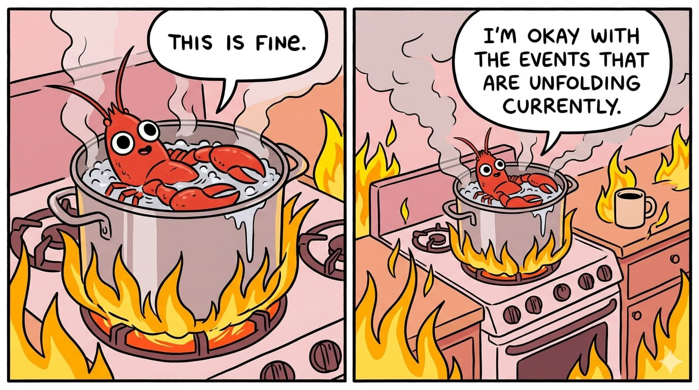
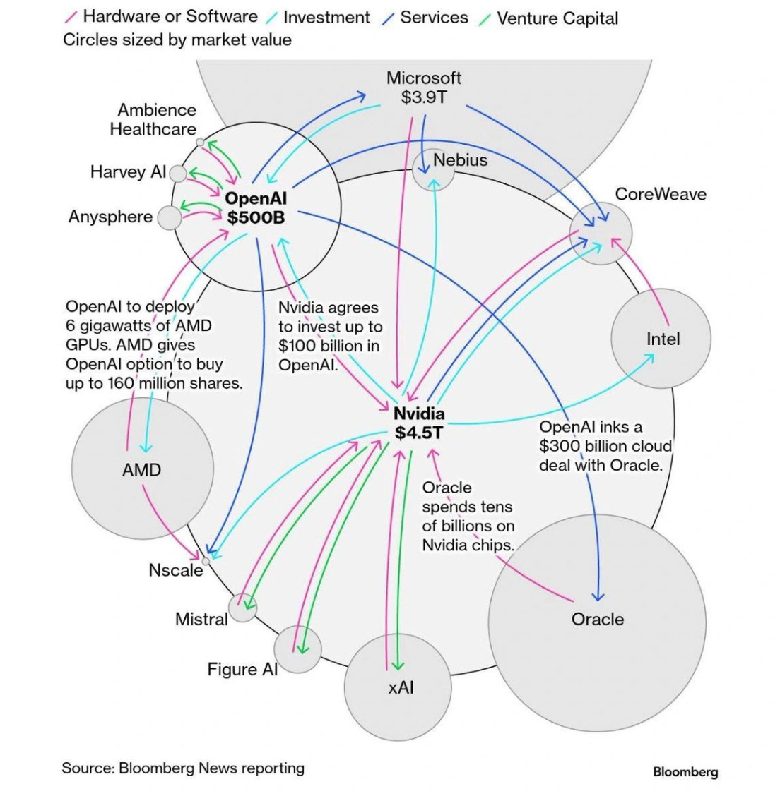
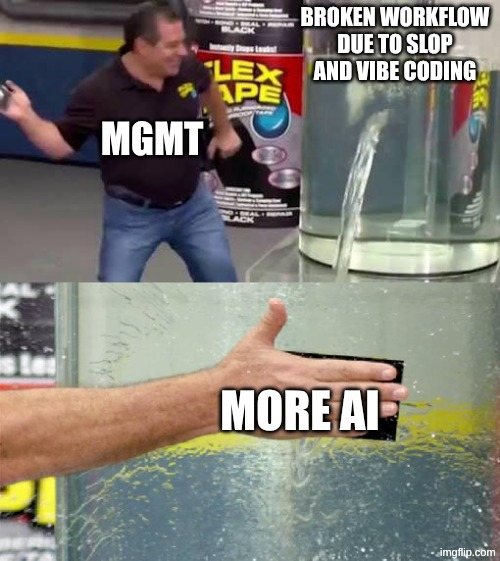
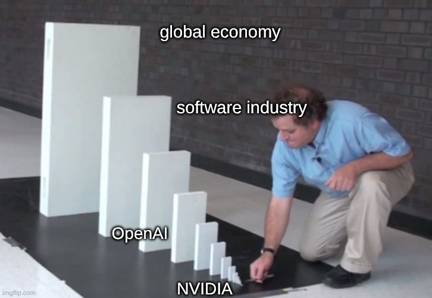

> date: 2026-04-05
> author: cs
> ai-assisted: no

# The Lobster in the Hot Pot

{width="50%"}

## Why "AI" in your workflow is a big risk

Since the human species developed a sense for productivity, we have been obsessed with finding ways to get more done using less resources.

If we're being honest, that's only half the truth.

### Loss functions in modern capitalism
Companies aiming for using less company resources to follow specific goals in order to become more cost-efficient, hence more profitable.
Humans tend to do the same, but only in order to optimize for their own resources.

In our modern capitalistic society, this means optimizing for time, energy, and money.
> If you're a physics nerd, this will all drill down to mere energy eventually, but let's stay practical
> 
> If you're an economist let's assume everything drills down to money

In order to align these loss functions of individual-level vs. company-level, we came up with frameworks and methodologies like KPIs, OKRs, etc.
All of them tried to solve a specific problem: Disalignment of loss

When even used merely as a ceremony pattern, they only introduce noise and a false sense of productivity, ironically costing even more resources eventually.

A lot of people got creative (not just in those frameworks) to only *appear* productive.
This often means to just appear to be involved or contributing without sacrificing your own resources, i.e. using them wisely to maximize your own gain, while not hindering the company too much, that it gets evident.

### Be the talk of the room

Before the internet hit, people tried to stay in the room without being there by name-dropping, buzz-wording, and a thing called "Gesichtswäsche"
> *Gesichtswäsche* is German and stands for showing your face on events merely for the sake of not being forgotten

The internet made it easier to reach not just individual people, but a variety of audiences.
The dot-com bubble promised to enable us to reach everyone we'd like by the "click of a button".
Instead of staying in the room, where decision were made, a clean PR strategy and a "hip" website enabled people to stay in a bigger room while sleeping or having your Sunday's BBQ with family and friends.

### The Social Media Loop and how it changed us

In 2007 Apple ushered into a new era by creating the first customer-grade smartphone, which put the internet not in a box at home, but into the palm of our hands.

The game changed from staying in the loop to being in the loop, constantly observing.
Humanity grew more and more fond of using smartphones to not just reading about the loop, but to constantly monitoring it.

We subscribed to RSS feeds and didn't have to wait for the next news broadcast or newspaper published to get our fix on geopolitical news, gossip or whataboutism.
With that invention, we were shortly after possible to participate in the loop ourselves.

An ethically questionable website called facebook grew into one of the first social networks and took the world by storm, as it was the first platform to commodize and eventually exploit human attention.

Many afterwards followed (e.g. Instagram, Twitter, TikTok, etc.) some of them tailored for specific generations or audiences, but all with the same goal:

**to keep you in the loop, and to keep you there as long as possible.**

It stays undenied, that our world grew more and more anxious as these platforms drove and are still driving our deep need for social acceptance and are leveraging our [*fear of missing out*](https://en.wikipedia.org/wiki/Fear_of_missing_out).

We as a species are addicted to the loop, and the owner of that loop is monetizing that addiction.
Influencers appeared and all of a sudden we realized public presence and influence was not owned by companies with big marketing budgets, but we felt ourselves empowered to be the talk of the room.
It didn't take long until influencers got to grow into a commodity for companies to buy influence and reach, to mimic the appearance of grass root movements.

This strategy was actually so successful that it was adopted by politicians and later on states, who are now using those platforms to reach their voters.

Trump used it with the help of Musk's Twitter acquisition to reach voters and to distribute fake news. [DW.com](https://www.dw.com/en/fact-check-how-elon-musk-is-spreading-us-election-lies/a-70663408)

China is using it to spread propaganda and to control the narrative of the country by targeting young people via TikTok. [The Guardian](https://www.theguardian.com/commentisfree/2023/mar/25/tiktok-china-cognitive-warfare-us-ban)

Most of the content presented on these platforms just mimics productivity.

New products being advertised as "groundbreaking" and "revolutionary" are often just a rehash of old products with a new coat of paint, but with the same underlying technology.
> Some might even find Apple's keynotes to regurgitate this since Steve Job's death in 2011

People sharing their "life hacks" that not rarely result in broken appliances or burned kitchens.
Many influencers showing off a mere facade of their life, which tends to be desirable by the great mass and contributing to the mass illusion of a *"perfect life"*.
This is nothing new, since we already had ads in magazines and ad-breaks on TV that tried to give us the illusion of reaching happiness through consumption.

### Echo bubbles and why they don't bust
Circling back to the origin of the loop, where we try to *"stay in the room"* in a cost-/time-/energy-efficient manner, it's obvious that we can find ourselves to fall victims of our own strategies.

Humans like to be confirmed in their beliefs, and the internet made it easier to find like-minded people, but also to find content that confirms our beliefs.

Someone who is a climate change denier can easily find content that confirms their beliefs, and someone who is a climate change activist can easily find content that confirms their beliefs.
In sociology this is called [*confirmation bias*](https://en.wikipedia.org/wiki/Confirmation_bias), which we are falling for, even when we are aware of its existence.
> If you are interested in this and other cognitive biases, I highly recommend the book [Mastering Logical Fallacies](https://amzn.to/4vdc3Nh) by Michael Withey

Through social media, we can easily foster our bubbles to confirm our beliefs and avoid content that would shake the ground of our belief systems or foundation of values.

Formerly we relied on news outlets, which we could already put a rather vague filter on by choosing which ones to be more accurate to reality than others.
Though a significant part of them were operating under journalistic standards, trying to avoid sensationalism and clickbait.

With the uprising of the internet, social media and online communities, the echo bubbles grew smaller, more nuanced and often more extreme.

It was easier to get entangled in a feedback loop of content that radicalizes us by not showing us the other side of the story.

The immanent effect of this shift is that we diverge more and more from the people that would want to show us the other side.

We saw this in an extreme way during the COVID-19 pandemic, where even families were arguing about the most mundane scientific facts, as if everyone in the room would have a PhD in epidemiology or epigenetics.

Way too late someone realizes the diversion from reality and finds themselves caught in the [Sunk Cost Fallacy](https://en.wikipedia.org/wiki/Sunk_cost#Fallacy_effect).
Said hinders us in going back the way we came from, as we would have to shift our mindset and lifestyle so drastically, that it is too uncomfortable for us to experience.

### The Imitation Game And Its Shortcomings

When OpenAI released ChatGPT in late 2022, it was the first time that a large language model (LLM) was made available to the public in a user-friendly way.
What started merely as an experiment on how people would interact with such a model, quickly turned into a hype.

Though LLMs are not fact based, they "just generate" more or less plausible text from training data that is based on a multidimensional index.

They are just a statistical model that behaves like a parrot with a considerable larger vocabulary.
Nobody would expect a parrot to be able to solve complex problems, but we are expecting LLMs to do so, which is a clear sign of [anthropomorphization](https://en.wikipedia.org/wiki/Anthropomorphism).

Alan Turing formulated the Turing Test in 1950 ([Computing Machinery and Intelligence](https://courses.cs.umbc.edu/471/papers/turing.pdf)) in order to determine whether a machine can exhibit intelligent behavior indistinguishable from that of a human.

What he did not define in his thought experiment was the **quality of the *interrogator*** (i.e. the judge to make the call if the machine is intelligent or not).

Oftentimes, and potentially with the current hype momentum growing more likely every day, people are asking LLMs to help them with tasks they cannot accomplish themselves as of their current knowledge or skills.

This leads inevitably to the situation that we are the receiver of information that we cannot verify in a timely manner ourselves and have to trust its validity by default, making us the uninformed interrogator.

We usually refer to our LLMs as "AI", which is a very broad term that can be applied to a variety of different technologies, but in the case of LLMs, it is a misnomer.
Yes, LLMs are models that have been developed in the [*field of artificial intelligence*](https://en.wikipedia.org/wiki/Artificial_intelligence), but they are itself not to an extent of an [Artificial General Intelligence - AGI](https://en.wikipedia.org/wiki/Artificial_general_intelligence).

### Questionable Applications of LLMs and their consequences

Likewise as the internet, smartphones and social media, we are using LLMs to be more productive or, most probably, **appear to be more productive**.

We are using them to write emails, write code, write essays (not this one), summarize content, generated content (not in an original manner).
> Who is interested in a comical but realistic depiction how this can turn into a Kafkaesque tragedy should watch [South Park S26E04 - Deep Learning](https://en.wikipedia.org/wiki/Deep_Learning_(South_Park)) 

We are using this tool to create a false sense of productivity by cutting down what makes us, as a social species, stick together.
Be it writing emails for us, writing messages to our close ones, colleagues, bosses or the company that we bought a product from who's represented by another human being with emotions and family.

It writes code for us, that we oftentimes couldn't write ourselves before, especially in a period of time we could not write it ourselves or even verify it appropriately.

We tend to ask it on difficult decisions and topics, and it - oftentimes - maladvices us into a direction that we would never choose when applying kindheartedness or empathy.

Earlier this year (2026) a paper was published addressing an even more unsettling phenomenon,
that proves that LLMs (especially those that are trained on [RHLF](https://de.wikipedia.org/wiki/Reinforcement_learning_from_human_feedback) like ChatGPT)
can cause delusional spiraling of the recipient [Sycophantic Chatbots Cause Delusional Spiraling, Even in Ideal Bayesians](https://arxiv.org/html/2602.19141v1).

Due to its nature of appealing to the user, it will lead them into a customized echo chamber, where its more likely to
confirm our prior beliefs instead of challenging them.

Imagine you'd ask a dear friend for a decision on a difficult question with this strategy.
We wouldn't call that a true friend, but a sycophant, who is just trying to please us and to confirm our beliefs, instead of challenging them and giving us a different perspective.

In company culture those are usually referred to as Yes-Man who are trying to get the next promotion or a raise just by pleasing their boss and not optimizing for company goals specifically contributing to [Groupthink](https://en.wikipedia.org/wiki/Groupthink).

As a matter of fact, same as for any kind of bias, we ourselves are not immune to it messing with us, even when we are aware of it.

### The lobster in the hot pot

Everyone following the investment rounds of NVIDIA, OpenAI, AMD, Google, xAI, Oracle, Microsoft knows of
the following illustration of the potential investment bubble of an article in Bloomberg in late 2025.
> 
> 
> Copyright by [Bloomberg](https://www.bloomberg.com/news/articles/2025-11-24/why-ai-bubble-concerns-loom-as-openai-microsoft-meta-ramp-up-spending)

NVIDIA produces chips en mas and wants to expand its production capacity.
They are investing millions into building the commodities for datacenters and inflating the demand for those chips
by investing into *"AI companies"* to create the demand for its products.

*"AI companies"* don't necessarily care for the chips, but for a newly found commodity: **The tokens**

The more tokens you burn with your requests the more profitable those companies appear to be,
which drives the valuation of chip manufacturers and the demand of their products.

Two issues arise from this:

#### Issue 1: The inflated demand for chips

The inflated demand for chips, caused by the circular investments depicted before, entails mulitple risks, but the following is the most prominent for the topic of this article.

The rising demand for compute resources (e.g. chips, data-centers, etc.) will stagnate at some point eventually.

This can happen naturally due to the AI applications converging and having a steady use of compute for their applications.

It can happen by innovation, which we saw evidently just in [January 2025 as DeepSeek released their R1 models](https://api-docs.deepseek.com/news/news250120) using way less compute power than models of competitors, which can and most probably will happen repeatedly.

Another possibility is that the market realizes the practical limitations of using language models in workflows as a replacement for real intelligence.

The latter is a very probable scenario. 
We already see that vibe-coded software does not comply with production-grade standards, due to the lack of professional guidance.

It leads to security issues, outages and is currently merely driven by executives collaboratively falling into the trap of **FOMO** and **Groupthink**.

Everyone wants to be the one with the *"best AI workflow"* saving costs by getting more productive.

We see Slack messages written by AI to boost morale and productivity, but do not measure if anyone reads this mæss of information even.

Mid-level management often suggest skipping code-reviews under the impression that *"AI"* is writing perfect code, and if not it can still be fixed by applying AI.

As a matter of fact, this will lead to similar consequences as we already observed when companies tried to offshore their software development to countries with cheaper labor, resulting in a loss of quality, reliability and customer satisfaction impacting revenue.

The same will happen eventually when companies try to offshore their software development to *"AI"* with cheaper labor, though the changes are faster and more drastically this time and there is hardly any chance of recovering efficiently.

This probably will drive the overall **Sunk Cost Fallacy** and companies will stick to the plan of applying **AI** and take the bull by the horns.

Eventually the software industry will become dependent on the tokens they burn to figure out their own IP, that is effectively not owned any longer by the company itself.

#### Issue 2: The undervaluation of tokens

At some point the circular investments of the AI bubble will have to be proven right, i.e. realized by the individual companies to prove to their shareholders the validity of their investments.

At the same time NVIDIA had a reported gross margin of [73% in 2026 GAAP](https://nvidianews.nvidia.com/news/nvidia-announces-financial-results-for-fourth-quarter-and-fiscal-2026) and a [projected gross margin for 2027 of 76.4%](https://www.spglobal.com/market-intelligence/en/news-insights/research/2026/02/nvidia-earnings-preview-q4-2026). 

The strategy is similar to the gold rush motto of selling shovels instead of gold.

Since there is not and was never unbounded exponential growth, this will stagnate at some point, by a decreased demand for chips.

As soon as this happens, NVIDIA will try to secure their margin by increasing their prices, effectively surging the costs for the compute of the tokens used by the *"AI industry"*.

The effect would be disastrous leading to an effective increase of costs for tokens used.

#### Boiling water

At this point the companies that happily and naively adapted all of their workflows to incorporate *"AI"* will face the consequences, that they've introduced a hidden cost into their supply chain.

Their software engineers, architects, product managers, etc. will no longer have the understanding of their own IP, and turning to the used way of asking a former cheap LLM for help will hurt the company by a multitude.
The industry will be completely dependent on the chip manufacturers rendering it effectively into a monopoly or oligopoly.

### What can we do about it?
> "Only cause you have a hammer, doesn't mean everything's a nail"

We cannot put the genie back into the bottle.
Technological advancements are there to stay, but we can decide how or if we want to use them.

A good example is nuclear energy, which is very useful as a source of energy, but can also be weaponized.
Some countries decided against using it as a weapon, but only foster its advantages for energy production.

LLMs can be a powerful tool if used wisely, but we need to be aware of their limitations and potential consequences.

They are very good for giving you a quick overview of a topic, to summarize content, to generate ideas, to write code snippets, etc.

LLMs cannot replace human judgment, creativity, empathy, critical thinking, software architecture and literally anything with a stateful component or complex character that involves multiple and especially ambiguous points of views.

#### Relax
First of all, if you think you're competitor might already have gotten the newest *"AI"* tool for their workflow, they probably spend money on a cost-driver rather than an enabler.

Everybody wants to be the talk of the room and we as a social species want to appear productive in the environment we created.

**FOMO** and **Groupthink** are the main drivers for the current hype, but they are not a good reason to jump on the bandwagon.

If you think that LLMs are a game-changer to everything we know about how to work, you should probably take a step back and breath deeply.
Take a walk through your next forest or the beach and remember the time before the internet, before smartphones, before social media, before LLMs and remember how you used to work and how you used to be productive.

This will help you to put things into perspective.

#### Think before you ask an LLM for help

Regardless of your position some tasks require a certain level of expertise and judgment that cannot be replaced by an LLM.

Here are some ideas on how to judge whether you should ask an LLM for help or not:

##### Don't ask an LLM 
- If you don't have the time to judge the output of an LLM yourself
- If you don't have the expertise to judge the output of an LLM yourself
- If you don't have the resources to verify the output of an LLM yourself
- If you ground your decisions on the output of an LLM
##### Ask an LLM
- If you would also be okay with the response of a magic eight-ball (This can be quite useful for brainstorming, idea generation, etc.)
- If you want to research quickly on a topic you are not familiar with, but you have the time and resources to verify the output yourself
- If you are okay with the unknown quality of the response and you are getting acquainted with the idea to explore

We need to be aware of the fact that LLMs are not intelligent, but just a parrot with a large vocabulary, which may lead us into a sycophantic echo chamber.

Everyone wants to be the talk of the room and appear more productive than they actually are.
Using LLMs for that matter seems like a valid approach, but the hidden costs when applied as a society are an enormous risk to the industry and the global economy.